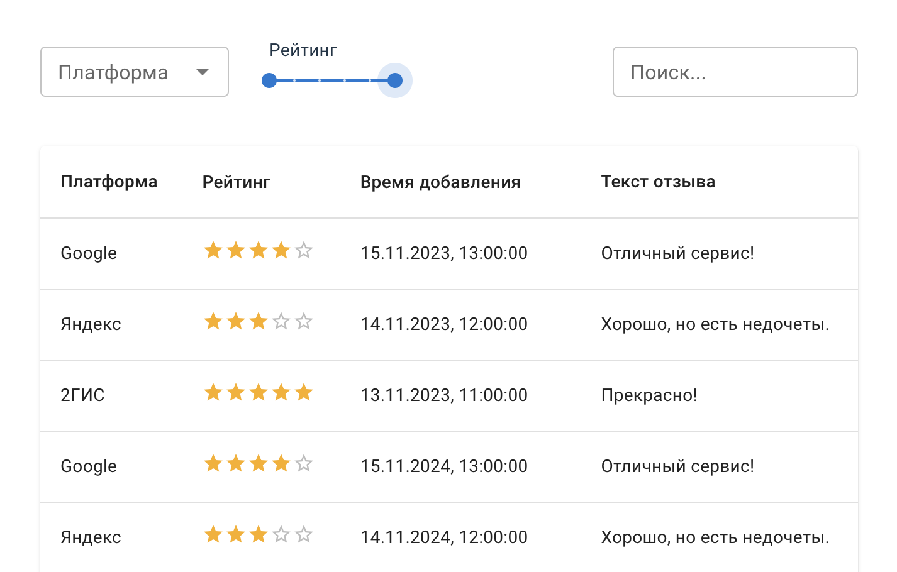

# hexlet-reviews

Создайте одностраничное приложение, которое позволяет:
1. Загружать список отзывов для одной компании через redux-saga .
2. Фильтровать отзывы:
   По платформе (Google, Яндекс, 2ГИС).
   По диапазону оценок (рейтинг от и до).
3. Сортировать отзывы:
   По времени (новые/старые).
   По оценке (по возрастанию/убыванию).
4. Отображать отфильтрованный и отсортированный список в табличной форме.
----

## Запуск проекта

```
npm install
npm run dev
```




